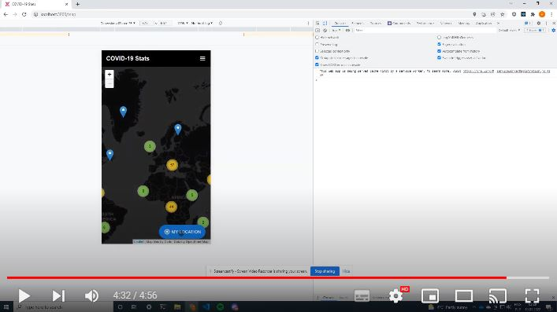

# **COVID-19 Stats** - data-driven React App
### **Advanced Front-End Web Development(CHT2531), assignment-01 (Jan. 2022), University of Huddersfield** 
**Patryk Świder, u1971957**
# **Installation**
## Installation and overview video
[](https://www.youtube.com/watch?v=COIxRmundO8)

## 1. Clone the repo
Clone the repo by using the following command:
```
git clone https://github.com/patryyq/covid-19-stats
```

## 2. CD into the project directory:
```
cd covid-19-stats
```

## 3. Install dependencies
Then, install the required dependencies:
```
npm i
```

## 4a) Run dev version

```
npm start
```

## **OR**

## 4b) Build and run web server
First:
```
npm run build
```
Then:
```
serve -s build
```